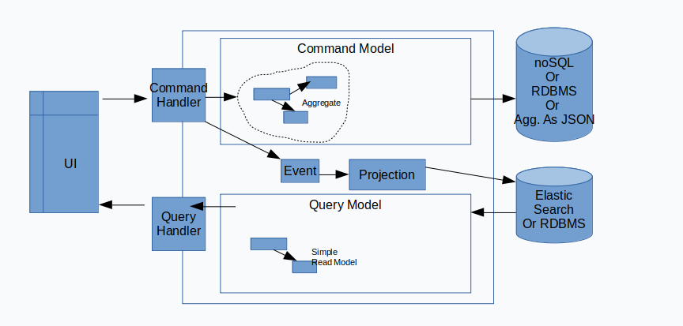

# 🚀 Marketplace Domain Driven Design

Modeling of a marketplace using domain driven design

----

## Introduction

### Architecture
The architecture starts on a monolith instead of micro-services.
The use of bounded context can quickly allow the transition to micro-services.

### Bounded Context
Each bounded context is independent and must be strictly separated. It contains 3 directories that respect the layered or hexagonal architecture:
- **Domain** that contains the business code with the most added value.
- **Infrastructure** implements the external services and the business logic implementation. This layer often evolves.
- **Application** is a layer between the Domain and the Infrastructure. The architecture of this directory can implement the principle of CQRS, Clean Architecture or simply services.

### Event Domain
domain events must be shared by bounded contexts and consumed asynchronously.

- Product
    - ProductPriceHasChanged
    - ProductStockHasChanged
    - ProductWasCreated

----

## Catalog
The catalog represents PIM and research.

The PIM stores its data in a relational database. The search uses an elastic search database.

Architecture CQRS

## Cart
...

## Order
...

## Seller
...

## Buyer
...
